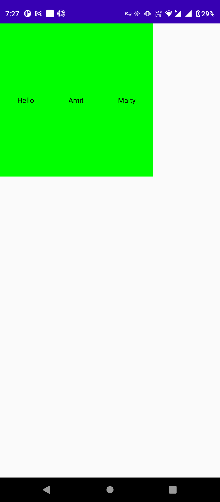
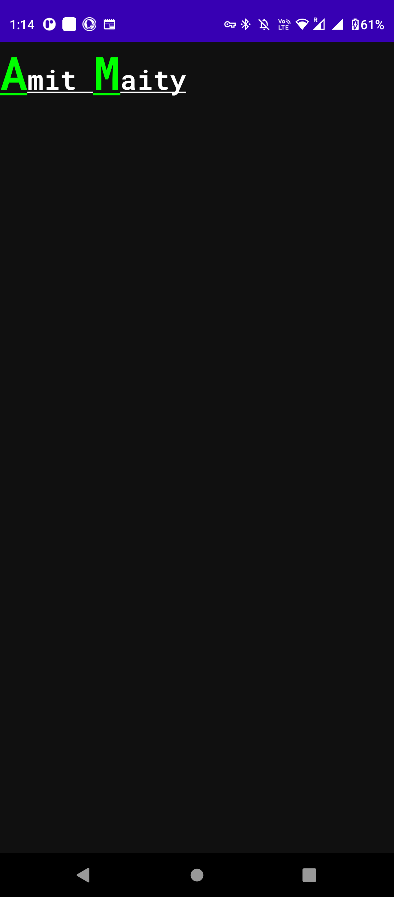
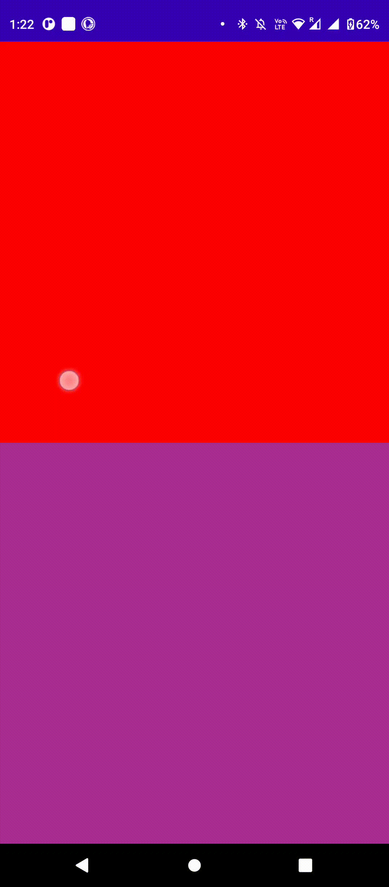
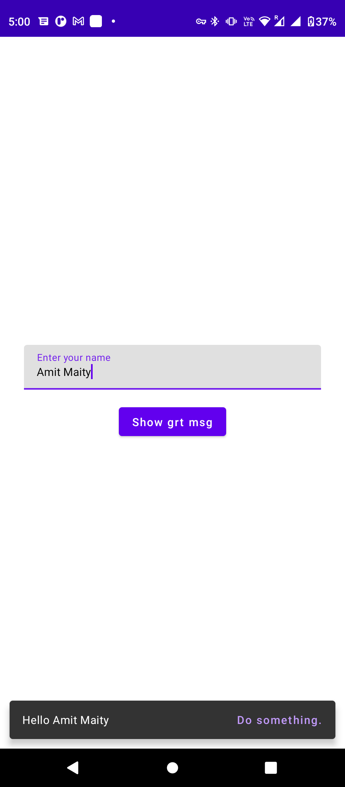
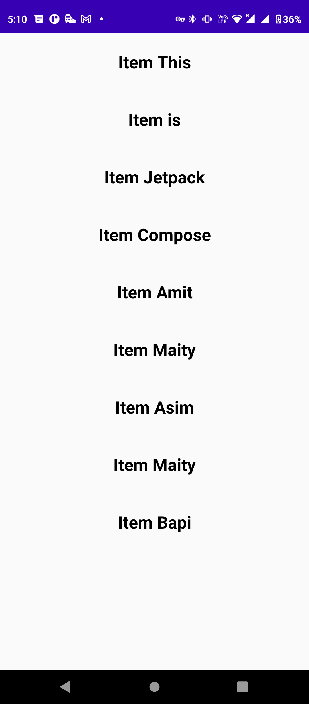
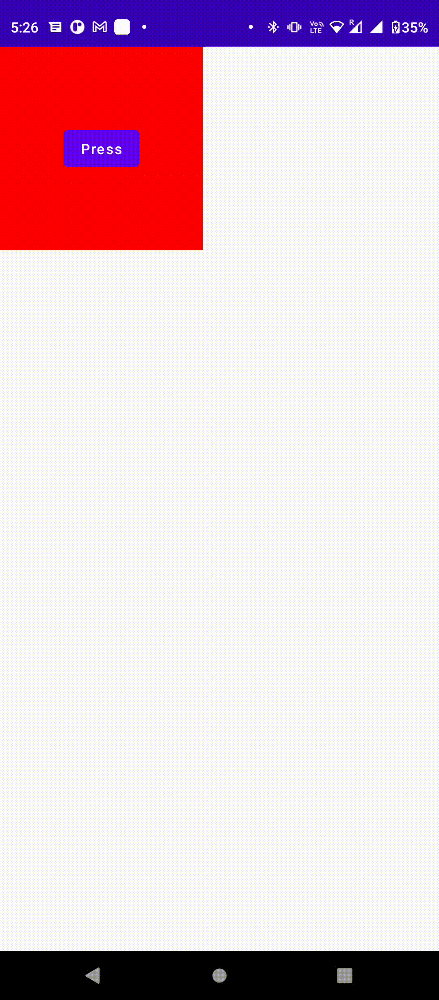

<h1 align="center">Jetpack Compose Android using Kotlin by Amit 🚀</h1>

 
<h1 align="center">⚙️ Technology Used</h1>

|||
|:----------------------------------------:|:-----------------------------------------:|
|  </a> <a href="https://www.java.com" target="_blank"> |  </a> <a href="https://www.java.com" target="_blank">  |

 
 

  
<h1 align="center">📸 Apps Demo</h1>
  
|||||
|:----------------------------------------:|:-----------------------------------------:|:-----------------------------------------:|:-----------------------------------------: |
|01|02-A|02-B|03|
|  |  |  |  |
|04|05|06|07|
|  |  |  |  |
|08|09|10|
|  |  |  |  |
  
  
   
  
   
  
  <h1 align="center">🔗 Important Link </h1>
  
  [1. Learing JetPack Compose Starting Phase](https://www.youtube.com/playlist?list=PLQkwcJG4YTCSpJ2NLhDTHhi6XBNfk9WiC)
  
   
   
  
<h1 align="center">🙍‍♂️ Contact Me</h1>
  

  
  

 
  
    
